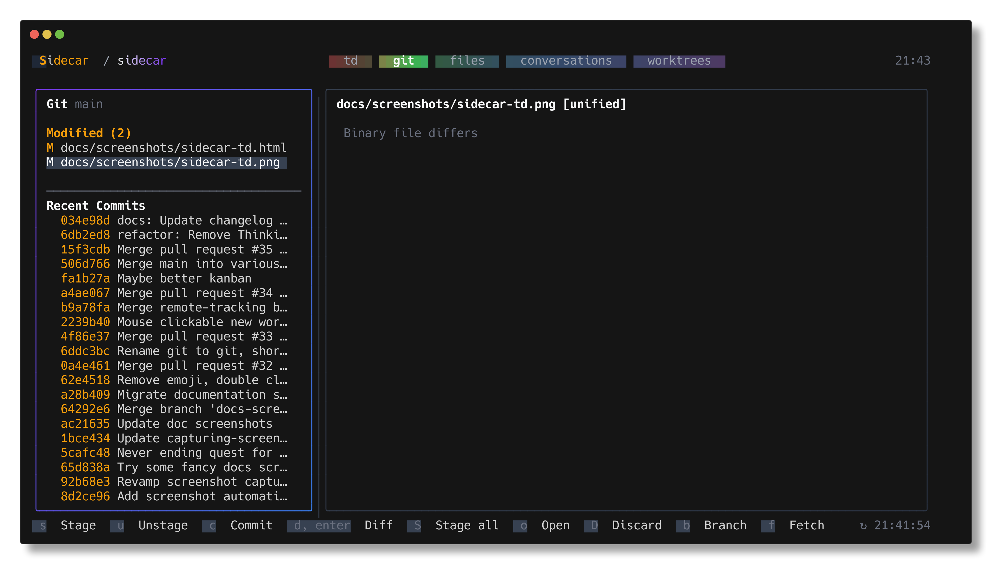
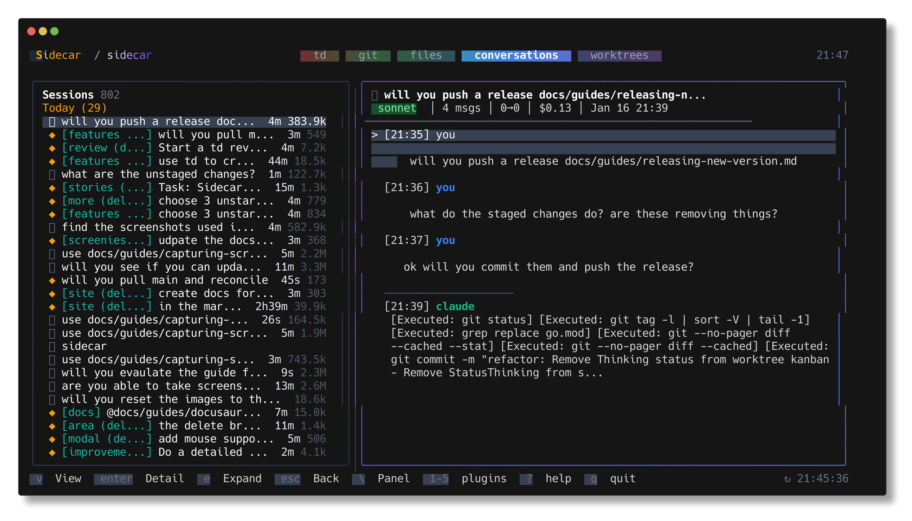
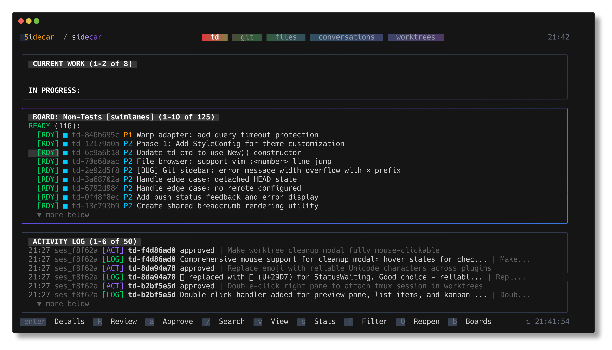
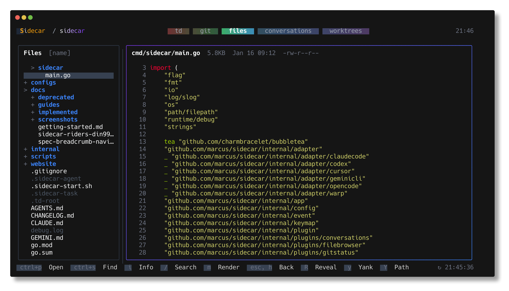

# Sidecar

You might never open your editor again.

**Status: Ready for daily use.** Please [report any issues](https://github.com/marcus/sidecar/issues) you encounter.

[Documentation](https://marcus.github.io/sidecar/) · [Getting Started](https://marcus.github.io/sidecar/docs/intro)



## Overview

Sidecar puts your entire development workflow in one shell: plan tasks with [td](https://github.com/marcus/td), chat with AI agents, review diffs, stage commits, review past conversations, and manage workspaces—all without leaving Sidecar.

## Quick Install

### macOS (recommended)

```bash
brew install marcus/tap/sidecar
```

This builds from source and avoids macOS Gatekeeper warnings.

### Linux / Other

```bash
curl -fsSL https://raw.githubusercontent.com/marcus/sidecar/main/scripts/setup.sh | bash
```

**More options:** [Binary downloads](https://github.com/marcus/sidecar/releases) · [Manual install](docs/getting-started.md)

## Requirements

- macOS, Linux, or WSL
- Go 1.21+ (only if building from source)

## Quick Start

After installation, run from any project directory:

```bash
sidecar
```

## Suggested Use

Split your terminal horizontally: run your coding agent (Claude Code, Cursor, etc.) on the left and sidecar on the right.

```
┌─────────────────────────────┬─────────────────────┐
│                             │                     │
│   Claude Code / Cursor      │      Sidecar        │
│                             │                     │
│   $ claude                  │   [Git] [Files]     │
│   > fix the auth bug...     │   [Tasks] [Workspaces]│
│                             │                     │
└─────────────────────────────┴─────────────────────┘
```

**Tip:** You can run two sidecar instances side-by-side to create a dashboard view. For example, keep one on the [Tasks] plugin and the other on [Git] or [Workspaces] to monitor everything at once.

As the agent works, you can:

- Watch tasks move through the workflow in TD Monitor
- See files change in real-time in the Git plugin
- Browse and edit code yourself in the File Browser
- View and resume conversations across all supported agent adapters
- Switch between built-in and community themes with live previews

This setup gives you visibility into what the agent is doing without interrupting your workflow. The entire dev loop—planning, monitoring, reviewing, committing—happens in the terminal while agents write the code.

## Usage

```bash
# Run from any project directory
sidecar

# Specify project root
sidecar --project /path/to/project

# Enable debug logging
sidecar --debug

# Check version
sidecar --version
```

## Updates

Sidecar checks for updates on startup. When a new version is available, a toast notification appears. Press `!` to open the diagnostics modal and see the update command.

## Plugins

### Git Status

View staged, modified, and untracked files with a split-pane interface. The sidebar shows files and recent commits; the main pane shows syntax-highlighted diffs. [Full documentation →](https://marcus.github.io/sidecar/docs/git-plugin)


**Features:**

- Stage/unstage files with `s`/`u`
- View diffs inline or full-screen with `d`
- Toggle side-by-side diff view with `v`
- Browse commit history and view commit diffs
- Auto-refresh on file system changes

### Conversations

Browse session history from multiple AI coding agents with message content, token usage, and search. Supports Amp Code, Claude Code, Codex, Cursor CLI, Gemini CLI, Kiro, OpenCode, and Warp. [Full documentation →](https://marcus.github.io/sidecar/docs/conversations-plugin)



**Features:**

- Unified view across all supported agents
- View all sessions grouped by date
- Search sessions with `/`
- Expand messages to see full content
- Track token usage per session

### TD Monitor

Integration with [TD](https://github.com/marcus/td), a task management system designed for AI agents working across context windows. TD helps agents track work, log progress, and maintain context across sessions—essential for AI-assisted development where context windows reset between conversations. [Full documentation →](https://marcus.github.io/sidecar/docs/td)



**Features:**

- Current focused task display
- Scrollable task list with status indicators
- Activity log with session context
- Quick review submission with `r`

See the [TD repository](https://github.com/marcus/td) for installation and CLI usage.

### File Browser

Navigate project files with a tree view and syntax-highlighted preview. [Full documentation →](https://marcus.github.io/sidecar/docs/files-plugin)



**Features:**

- Collapsible directory tree
- Code preview with syntax highlighting
- Auto-refresh on file changes

### Workspaces

Manage workspaces for parallel development with integrated agent support. Create isolated branches as sibling directories, link tasks from TD, and launch coding agents directly from sidecar. [Full documentation →](https://marcus.github.io/sidecar/docs/workspaces-plugin)


**Features:**

- Create and delete workspaces with `n`/`D`
- Link TD tasks to workspaces for context tracking
- Launch Claude Code, Cursor, or OpenRouter agents with `a`
- Merge workflow: commit, push, create PR, and cleanup with `m`
- Auto-adds sidecar state files to .gitignore
- Preview diffs and task details in split-pane view

## Project Switcher

Press `@` to switch between configured projects without restarting sidecar.

1. Add projects to `~/.config/sidecar/config.json`:

```json
{
  "projects": {
    "list": [
      { "name": "sidecar", "path": "~/code/sidecar" },
      { "name": "td", "path": "~/code/td" },
      { "name": "my-app", "path": "~/projects/my-app" }
    ]
  }
}
```

2. Press `@` to open the project switcher modal
3. Select with `j/k` or click, press `Enter` to switch

All plugins reinitialize with the new project context. State (active plugin, cursor positions) is remembered per project.

## Worktree Switcher

Press `W` to switch between git worktrees within the current repository. When you switch away from a project and return later, sidecar remembers which worktree you were working in and restores it automatically.

## Themes

Press `#` to open the theme switcher. Choose from built-in themes (default, dracula) or press `Tab` to browse 453 community color schemes derived from iTerm2-Color-Schemes.

The community browser supports search filtering, live preview as you navigate, and color swatches for each scheme. Press `Enter` to save a scheme as your active theme.

See [Theme Creation Skill](.claude/skills/create-theme/SKILL.md) for custom theme creation and color palette reference.

## Keyboard Shortcuts

| Key                 | Action                           |
| ------------------- | -------------------------------- |
| `q`, `ctrl+c`       | Quit                             |
| `@`                 | Open project switcher            |
| `W`                 | Open worktree switcher           |
| `#`                 | Open theme switcher              |
| `tab` / `shift+tab` | Navigate plugins                 |
| `1-9`               | Focus plugin by number           |
| `j/k`, `↓/↑`        | Navigate items                   |
| `ctrl+d/u`          | Page down/up in scrollable views |
| `g/G`               | Jump to top/bottom               |
| `enter`             | Select                           |
| `esc`               | Back/close                       |
| `r`                 | Refresh                          |
| `?`                 | Toggle help                      |

### Git Status Shortcuts

| Key   | Action                    |
| ----- | ------------------------- |
| `s`   | Stage file                |
| `u`   | Unstage file              |
| `d`   | View diff (full-screen)   |
| `v`   | Toggle side-by-side diff  |
| `h/l` | Switch sidebar/diff focus |
| `c`   | Commit staged changes     |

### Workspace Shortcuts

| Key | Action                  |
| --- | ----------------------- |
| `n` | Create new workspace     |
| `D` | Delete workspace         |
| `a` | Launch/attach agent     |
| `t` | Link/unlink TD task     |
| `m` | Start merge workflow    |
| `p` | Push branch             |
| `o` | Open in finder/terminal |

## Configuration

Config file: `~/.config/sidecar/config.json`

```json
{
  "plugins": {
    "git-status": { "enabled": true, "refreshInterval": "1s" },
    "td-monitor": { "enabled": true, "refreshInterval": "2s" },
    "conversations": { "enabled": true },
    "file-browser": { "enabled": true },
    "workspaces": { "enabled": true }
  },
  "ui": {
    "showClock": true,
    "theme": {
      "name": "default",
      "overrides": {}
    }
  }
}
```

## Contributing

- **Bug reports**: [Open an issue](https://github.com/marcus/sidecar/issues)
- **Feature requests**: Check the [Sidecar Roadmap](https://github.com/users/marcus/projects/3) for planned features and backlog

## Development

```bash
make build        # Build to ./bin/sidecar
make test         # Run tests
make test-v       # Verbose test output
make install-dev  # Install with git version info
make fmt          # Format code
make fmt-check    # Verify formatting for changed Go files
make fmt-check-all # Verify formatting across full codebase
make lint         # Lint new issues only (merge-base with main)
make lint-all     # Lint entire codebase (includes legacy debt)
```

### Go Lint Baseline

- Formatting: changed Go files must be `gofmt`-clean (`make fmt-check`)
- Correctness lint: `errcheck`, `govet`, `ineffassign`, `staticcheck`, `unused`
- Enforcement: CI runs tests and blocks new lint issues on PRs (`.github/workflows/go-ci.yml`)
- Debt tracking: run `make lint-all` to measure and burn down legacy lint debt

## License

MIT
