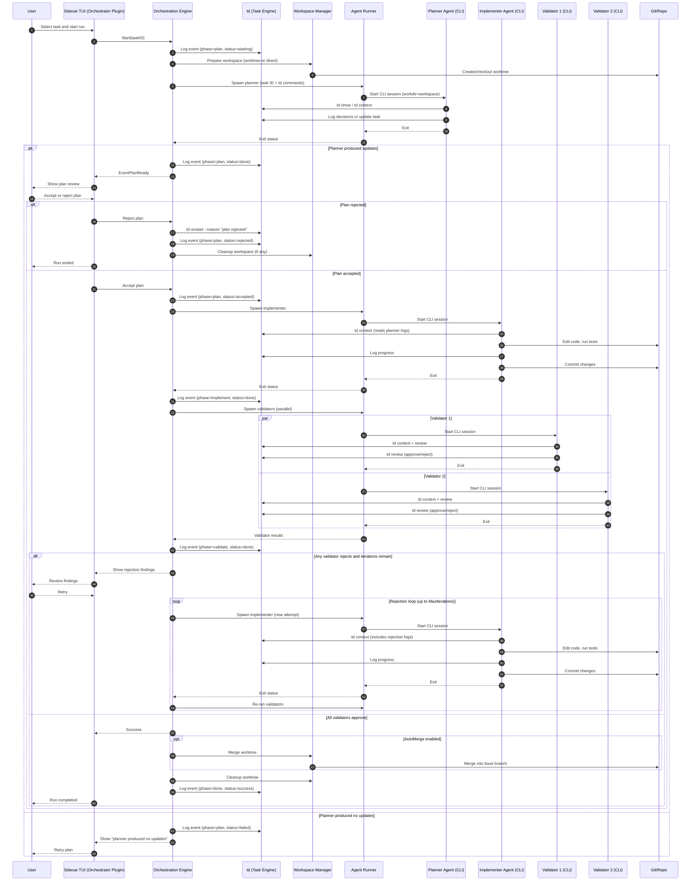

# Agent Orchestration Sequence Diagram

```mermaid
sequenceDiagram
    autonumber
    participant User
    participant TUI as Sidecar TUI (Orchestrator Plugin)
    participant Engine as Orchestration Engine
    participant TD as td (Task Engine)
    participant WS as Workspace Manager
    participant Runner as Agent Runner
    participant Planner as Planner Agent (CLI)
    participant Impl as Implementer Agent (CLI)
    participant V1 as Validator 1 (CLI)
    participant V2 as Validator 2 (CLI)
    participant Git as Git/Repo

    User->>TUI: Select task and start run
    TUI->>Engine: Start(taskID)
    Engine->>TD: Log event (phase=plan, status=starting)
    Engine->>WS: Prepare workspace (worktree or direct)
    WS->>Git: Create/checkout worktree

    Engine->>Runner: Spawn planner (task ID + td commands)
    Runner->>Planner: Start CLI session (workdir=workspace)
    Planner->>TD: td show / td context
    Planner->>TD: Log decisions or update task
    Planner-->>Runner: Exit
    Runner-->>Engine: Exit status

    alt Planner produced updates
        Engine->>TD: Log event (phase=plan, status=done)
        Engine-->>TUI: EventPlanReady
        TUI-->>User: Show plan review
        User-->>TUI: Accept or reject plan

        alt Plan rejected
            TUI->>Engine: Reject plan
            Engine->>TD: td unstart --reason "plan rejected"
            Engine->>TD: Log event (phase=plan, status=rejected)
            Engine->>WS: Cleanup workspace (if any)
            TUI-->>User: Run ended
        else Plan accepted
            TUI->>Engine: Accept plan
            Engine->>TD: Log event (phase=plan, status=accepted)

            Engine->>Runner: Spawn implementer
            Runner->>Impl: Start CLI session
            Impl->>TD: td context (reads planner logs)
            Impl->>Git: Edit code, run tests
            Impl->>TD: Log progress
            Impl->>Git: Commit changes
            Impl-->>Runner: Exit
            Runner-->>Engine: Exit status
            Engine->>TD: Log event (phase=implement, status=done)

            Engine->>Runner: Spawn validators (parallel)
            par Validator 1
                Runner->>V1: Start CLI session
                V1->>TD: td context + review
                V1->>TD: td review (approve/reject)
                V1-->>Runner: Exit
            and Validator 2
                Runner->>V2: Start CLI session
                V2->>TD: td context + review
                V2->>TD: td review (approve/reject)
                V2-->>Runner: Exit
            end
            Runner-->>Engine: Validator results
            Engine->>TD: Log event (phase=validate, status=done)

            alt Any validator rejects and iterations remain
                Engine-->>TUI: Show rejection findings
                TUI-->>User: Review findings
                User-->>TUI: Retry
                loop Rejection loop (up to MaxIterations)
                    Engine->>Runner: Spawn implementer (new attempt)
                    Runner->>Impl: Start CLI session
                    Impl->>TD: td context (includes rejection logs)
                    Impl->>Git: Edit code, run tests
                    Impl->>TD: Log progress
                    Impl->>Git: Commit changes
                    Impl-->>Runner: Exit
                    Runner-->>Engine: Exit status
                    Engine->>Runner: Re-run validators
                end
            else All validators approve
                Engine-->>TUI: Success
                opt AutoMerge enabled
                    Engine->>WS: Merge worktree
                    WS->>Git: Merge into base branch
                end
                Engine->>WS: Cleanup worktree
                Engine->>TD: Log event (phase=done, status=success)
                TUI-->>User: Run completed
            end
        end
    else Planner produced no updates
        Engine->>TD: Log event (phase=plan, status=failed)
        Engine-->>TUI: Show "planner produced no updates"
        TUI-->>User: Retry plan
    end
```
