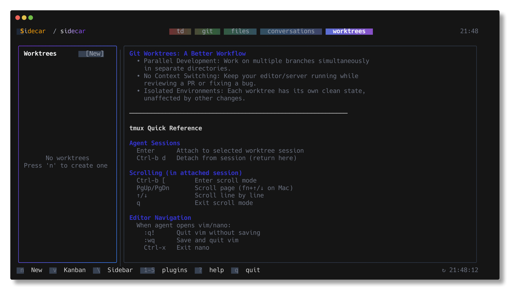

# Worktrees Plugin

Parallel development environments with integrated AI agents. Create isolated worktrees, launch Claude Code or Cursor, stream real-time output, and merge when ready—all from one terminal interface.



## What is this?

The Worktrees plugin turns git worktrees into managed development environments. Each worktree gets its own directory, branch, and optional AI agent (Claude Code, Codex, Gemini, Cursor, or OpenCode). You work on multiple features in parallel, watch agent output in real-time, review diffs, and merge via PR—all without leaving sidecar.

**Key capabilities:**

- **Create worktrees** with one command: branch + task + agent + prompt
- **Launch AI agents** into isolated environments with reusable prompt templates
- **Stream real-time output** from Claude Code, Cursor, or any supported agent
- **Monitor multiple agents** via Kanban board or list view with live status
- **Review & merge** with built-in diff viewer and GitHub PR workflow
- **Automatic cleanup** of local/remote branches after merge

This workflow eliminates context-switching between branches and enables true parallel development.

## The Problem

**Without worktrees:**
- Switch branches to start new work, losing current context
- Stash/commit WIP changes to avoid conflicts
- One agent at a time, waiting for completion
- Manual tmux session management
- Scattered terminal tabs for different tasks

**With sidecar worktrees:**
- Instant parallel development: 5 agents on 5 branches simultaneously
- Zero context loss: each worktree is isolated, never conflicts
- Unified dashboard: see all agents, all output, all diffs in one place
- Automatic session management: reconnects to agents after restart
- Integrated PR workflow: diff → push → PR → cleanup in 4 keystrokes

**Real use case:**
You're working on a feature when a critical bug report arrives. Press `n`, create a "hotfix-login" worktree from `main`, launch Claude Code with the "Bug Fix" prompt, and let it work while you continue your feature. Both agents run in parallel. When Claude finishes, review the hotfix diff, merge it via PR, and return to your feature—without ever switching branches or losing state.

## Prerequisites

**Required:**
- Git 2.25+ (for worktree support)
- Tmux 3.0+ (for agent session management)

**Optional (for specific features):**
- `gh` CLI (for GitHub PR creation in merge workflow)
- `claude` CLI (for Claude Code agent)
- `cursor-agent` CLI (for Cursor agent)
- `codex` CLI (for Codex agent)
- `gemini` CLI (for Gemini agent)
- `opencode` CLI (for OpenCode agent)
- `td` CLI (for task linking)

Install agents as needed. The plugin gracefully handles missing CLIs—only installed agents appear in the picker.

## Quick Start

Press `n` to create your first worktree. Select a base branch, choose an agent (Claude Code, Cursor, etc.), and optionally pick a reusable prompt. The agent starts immediately in an isolated tmux session. Press `enter` to attach and interact, or watch output stream live in the preview pane.

When done, press `m` to review the diff, create a GitHub PR, and clean up branches—all in one flow.

## Configuration

Worktree behavior is configured via JSON files:

**Global config:** `~/.config/sidecar/config.json`
**Project config:** `.sidecar/config.json` (overrides global)

**Example config:**

```json
{
  "plugins": {
    "worktree": {
      "dirPrefix": true,
      "setupScript": ".sidecar/setup-worktree.sh"
    }
  },
  "prompts": [
    {
      "name": "Bug Fix",
      "ticketMode": "required",
      "body": "Fix issue {{ticket}}. Run tests before marking complete."
    },
    {
      "name": "Feature",
      "ticketMode": "optional",
      "body": "Implement {{ticket}}. Follow existing patterns. Write tests."
    }
  ]
}
```

**Config options:**

| Option | Type | Description |
|--------|------|-------------|
| `dirPrefix` | bool | Prefix worktree dir with repo name (e.g., `myrepo-feature-auth`) |
| `setupScript` | string | Path to script run after worktree creation (for env setup, symlinks, etc.) |

The setup script runs in the new worktree directory with `$SIDECAR_WORKTREE_NAME` and `$SIDECAR_BASE_BRANCH` environment variables.

## Overview

The Worktrees plugin provides a two-pane layout:

- **Left pane**: Worktree list (or Kanban columns)
- **Right pane**: Preview tabs (Output, Diff, Task)
- **Draggable divider**: Resize panes to your preference

Toggle views with `v` for list or Kanban board.

## View Modes

### List View (Default)

Vertical list of all worktrees with rich status information:

| Status | Meaning | Visual Indicator |
|--------|---------|------------------|
| **Active** | Agent running, processing tasks | Green dot |
| **Waiting** | Agent paused for approval | Yellow dot |
| **Done** | Work completed successfully | Blue checkmark |
| **Paused** | Agent stopped or no agent | Gray dot |
| **Error** | Agent crashed or failed | Red X |

Each row shows:
- Worktree name and branch
- Agent type (Claude Code, Cursor, etc.)
- Task ID (if linked to TD)
- Creation time (relative, e.g., "2h ago")
- Status indicator

### Kanban View

Press `v` to switch to Kanban board with columns organized by status:

| Column | Description |
|--------|-------------|
| **Active** | Agents currently processing (green) |
| **Waiting** | Agents blocked on approval (yellow) |
| **Done** | Completed work ready to merge (blue) |
| **Paused** | Stopped or idle worktrees (gray) |

Each column shows:
- Worktree count at the top
- Cards with name, agent type, and task
- Visual color coding for quick status assessment

Navigate columns with `h`/`l` (vim keys) or arrow keys. Press `v` to toggle back to list view.

**When to use Kanban:**
- Managing 5+ parallel worktrees
- Visual overview of agent pipeline
- Quick status triage across many tasks

**When to use List:**
- Detailed view of individual worktrees
- Faster keyboard navigation
- More information density

## Worktree Navigation

| Key | Action |
|-----|--------|
| `j`, `↓` | Move down |
| `k`, `↑` | Move up |
| `g` | Jump to first |
| `G` | Jump to last |
| `h`, `←` | Previous column (Kanban) |
| `l`, `→` | Next column (Kanban) or focus preview |
| `v` | Toggle list/Kanban view |

## Preview Tabs

Three tabs in the preview pane provide different views of worktree state:

| Key | Action |
|-----|--------|
| `[` | Previous tab |
| `]` | Next tab |

### Output Tab

Real-time streaming of agent terminal output. Shows exactly what the agent sees—including prompts, tool calls, file edits, and command outputs.

**Features:**
- Captures tmux pane content every 500ms (adaptive: slower when idle, faster when active)
- Auto-scroll follows new output (pauses on manual scroll, resumes with `G`)
- ANSI color support for syntax highlighting
- Unicode-safe truncation (no broken multibyte chars)
- Handles high-velocity output without memory leaks

| Key | Action |
|-----|--------|
| `j`, `↓` | Scroll down (pauses auto-scroll) |
| `k`, `↑` | Scroll up |
| `ctrl+d` | Page down |
| `ctrl+u` | Page up |
| `g` | Jump to top |
| `G` | Jump to bottom (resumes auto-scroll) |

**What you'll see:**
- Agent initialization and model selection
- Tool calls and file operations
- Approval prompts (if not skipped)
- Error messages and stack traces
- Completion messages

### Diff Tab

Full git diff for the worktree branch compared to base branch. Shows all changes the agent made.

**Features:**
- Unified diff (traditional +/- format)
- Side-by-side diff (split-screen before/after)
- Syntax highlighting for code changes
- Horizontal scroll for wide diffs
- Merge conflict detection and highlighting

| Key | Action |
|-----|--------|
| `v` | Toggle unified/side-by-side view |
| `h`, `←` | Scroll left (wide diffs) |
| `l`, `→` | Scroll right |
| `0` | Reset horizontal scroll |

Diff mode preference persists across sessions.

### Task Tab

Displays linked TD task with full context. Shows task title, description, acceptance criteria, and metadata.

**Features:**
- Markdown rendering (headings, lists, code blocks, emphasis)
- Raw text mode (toggle off for plain view)
- Scrollable content for long task descriptions
- Automatic task link detection from `.sidecar-task` file

| Key | Action |
|-----|--------|
| `m` | Toggle markdown rendering |
| `j`, `↓` | Scroll down |
| `k`, `↑` | Scroll up |

Empty if no task is linked. Press `t` in the sidebar to link a task.

## Agent Integration

The worktrees plugin runs AI coding agents in isolated tmux sessions and streams their output in real-time. Each worktree can have one active agent. Sessions persist across plugin restarts—sidecar automatically reconnects to running agents.

### Supported Agents

| Agent | Command | Description |
|-------|---------|-------------|
| **Claude Code** | `claude` | Anthropic's official CLI with browser control |
| **Codex** | `codex` | Alternative Claude-based coding agent |
| **Gemini** | `gemini` | Google's Gemini CLI |
| **Cursor Agent** | `cursor-agent` | Cursor's autonomous coding agent |
| **OpenCode** | `opencode` | OpenRouter-based coding assistant |

### Starting Agents

| Key | Action |
|-----|--------|
| `s` | Start agent (opens agent picker) |

If no agent is running, opens a modal to select:
- Claude Code
- Codex
- Gemini
- Cursor Agent
- OpenCode
- None (just open terminal)

### Attaching to Agents

| Key | Action |
|-----|--------|
| `enter` | Attach to running agent |

Opens the agent's tmux session for direct interaction. Press `ctrl+b` then `d` to detach back to sidecar.

### Real-Time Output Streaming

Agent output streams live in the **Output** tab. The plugin captures tmux pane content every 500ms (or slower when idle). Auto-scroll follows new output—manual scrolling pauses it, press `G` to resume.

**Status detection:**
- **Active**: Agent running, cursor visible in output
- **Waiting**: Agent paused for approval (detected via prompts)
- **Done**: Agent completed successfully
- **Paused**: Agent stopped or session ended
- **Error**: Agent crashed or failed

### Agent Controls

| Key | Action |
|-----|--------|
| `S` | Stop agent (kills tmux session) |
| `y` | Approve pending action |
| `Y` | Approve all pending prompts |
| `N` | Reject pending action |

Approval keys work with agents in "Waiting" status. The plugin detects common approval prompts from Claude Code, Codex, and Cursor.

### Skip Permissions Mode

When creating a worktree, enable "Skip perms" to auto-approve agent actions. Each agent has a corresponding flag:

| Agent | Flag |
|-------|------|
| Claude Code | `--dangerously-skip-permissions` |
| Codex | `--dangerously-bypass-approvals-and-sandbox` |
| Gemini | `--yolo` |
| Cursor | `-f` |

**Warning:** Skip permissions mode grants agents unrestricted file access. Only use for trusted prompts in sandboxed environments.

## Shell Management

Shells are standalone tmux sessions created for direct terminal access without an AI agent. They appear in the sidebar alongside worktrees for easy switching.

### Creating Shells

Press `n` and select "Shell" from the type selector modal, or press `A` in the sidebar to quickly create a new shell. Each shell is created with an auto-numbered display name (e.g., "Shell 1", "Shell 2") and a stable tmux session name for state persistence.

### Renaming Shells

Press `R` to rename a shell with a custom display name:

1. **Modal appears**: Shows current name and tmux session ID
2. **Type new name**: Input field accepts up to 50 characters
3. **Validation**: Name must be unique and non-empty
4. **Confirm**: Press Enter to save, Esc to cancel

Custom names persist across sidecar restarts. The underlying tmux session name (e.g., `sidecar-sh-project-1`) remains stable for reliable state restoration.

**Example:**
- Default name: "Shell 1"
- Rename to: "Backend"
- Rename to: "Testing"
- Custom names appear in the sidebar for easy identification

### Deleting Shells

Press `D` to delete a shell session. This terminates the underlying tmux session and removes it from the sidebar.

### Shell Capabilities

| Operation | Key | Description |
|-----------|-----|-------------|
| Create shell | `n` + select Shell | Create new terminal session |
| Rename shell | `R` | Change display name (50 char limit) |
| Delete shell | `D` | Terminate tmux session |
| Attach to shell | `enter` | Interactive access to terminal |
| Kill shell | `K` | Force-terminate session |

## Worktree Operations

### Creating Worktrees

Press `n` to open the create modal:

| Field | Description |
|-------|-------------|
| **Name** | Worktree branch name (e.g., `feature-auth`) |
| **Base branch** | Branch to create from (defaults to `HEAD` / current branch) |
| **Prompt** | Reusable prompt template with variables (optional) |
| **Task** | Link to TD task for context (optional) |
| **Agent** | AI agent to launch (Claude Code, Cursor, etc.) |
| **Skip perms** | Auto-approve agent actions (dangerous, see warning above) |

**What happens on creation:**

1. Git creates a worktree in a sibling directory (e.g., `../feature-auth`)
2. A new branch is created from the base branch
3. If a task is linked, a `.sidecar-task` file is created and `td start` runs
4. If an agent is selected, it launches in a tmux session named `sidecar-wt-<name>`
5. If a prompt is selected, it's passed as the initial instruction to the agent
6. The worktree appears in the list with "Active" status (if agent running)

#### Reusable Prompts

Prompts are templates stored in JSON config files. They support variables like `{{ticket}}` for dynamic substitution.

**Config locations:**

- **Global**: `~/.config/sidecar/config.json`
- **Project**: `.sidecar/config.json` (project-specific, overrides global)

**Example config:**

```json
{
  "prompts": [
    {
      "name": "Bug Fix",
      "ticketMode": "required",
      "body": "Fix issue {{ticket}}. Run all tests before marking complete."
    },
    {
      "name": "Feature Development",
      "ticketMode": "optional",
      "body": "Implement {{ticket}}. Follow existing patterns in the codebase. Write tests for new functionality."
    },
    {
      "name": "Refactor",
      "ticketMode": "none",
      "body": "Refactor the selected code to improve readability and maintainability. Do not change behavior. Run tests to verify."
    }
  ]
}
```

**Prompt variables:**

- `{{ticket}}`: Replaced with task ID (if ticketMode is "required" or "optional")
- `{{taskTitle}}`: Replaced with task title from TD
- `{{taskBody}}`: Replaced with task description from TD

**Ticket modes:**

- `required`: Must link a task, variable is replaced
- `optional`: Can link a task, variable is replaced if present
- `none`: No task linking, no variable substitution

Modal navigation:

| Key | Action |
|-----|--------|
| `tab` | Next field |
| `shift+tab` | Previous field |
| `j`, `↓` | Navigate dropdowns |
| `k`, `↑` | Navigate dropdowns |
| `enter` | Select or confirm |
| `esc` | Cancel |

### Deleting Worktrees

| Key | Action |
|-----|--------|
| `D` | Delete worktree |

Opens confirmation with options:
- Delete local branch
- Delete remote branch

| Key | Action |
|-----|--------|
| `j`, `↓` | Navigate options |
| `space` | Toggle checkbox |
| `enter` | Confirm |
| `D` | Quick delete (power user) |
| `esc` | Cancel |

### Push & Remote

| Key | Action |
|-----|--------|
| `p` | Push branch to remote |

## Task Linking

Link worktrees to TD tasks for context:

| Key | Action |
|-----|--------|
| `t` | Link/unlink TD task |

Opens task picker to select from open tasks.

## Complete Workflow Example

Here's a typical worktree lifecycle from creation to merge:

**1. Create a worktree for a new feature:**

Press `n`, enter name "feature-auth", select base branch "main", pick prompt "Feature Development", link task "td-abc123", choose agent "Claude Code", enable "Skip perms" for autonomy. Press Enter.

**2. Agent works autonomously:**

Claude Code starts immediately with your prompt. Watch live output in the **Output** tab. Status updates to "Active" → "Waiting" (if approval needed) → "Done" when complete.

**3. Review the diff:**

Switch to **Diff** tab to see all changes. Press `v` to toggle side-by-side view. Scroll horizontally with `h`/`l` for wide diffs.

**4. Merge via PR:**

Press `m` to start the merge workflow:
- **Step 1**: Review final diff
- **Step 2**: Choose merge method (merge commit / squash / rebase)
- **Step 3**: Create GitHub PR (via `gh pr create`)
- **Step 4**: Choose cleanup options (delete local branch, delete remote branch)

**5. Cleanup:**

After PR is merged (manually or via GitHub), run step 4 again to delete the worktree directory and branches.

## Merge Workflow

Press `m` to start a multi-step merge:

1. **Diff review**: See all changes to be merged
2. **Method selection**: Choose merge strategy (merge commit, squash, rebase)
3. **PR creation**: Creates GitHub PR via `gh` CLI (requires `gh` installed)
4. **Cleanup options**: Delete local branch, remote branch, and worktree directory

| Key | Action |
|-----|--------|
| `j`, `↓` | Navigate options |
| `enter` | Proceed to next step |
| `space` | Toggle checkboxes |
| `tab` | Cycle focus |
| `s` | Skip step (if already pushed) |
| `esc`, `q` | Cancel merge |

**Prerequisites:**

- `gh` CLI installed and authenticated (`gh auth login`)
- Remote tracking branch configured (push first with `p` if needed)

## Pane Navigation

| Key | Action |
|-----|--------|
| `tab` | Switch to next pane |
| `shift+tab` | Switch to previous pane |
| `l`, `→` | Focus preview pane |
| `h`, `←` | Focus sidebar |
| `enter` | Focus preview (from list) |
| `esc` | Return to sidebar |
| `\` | Toggle sidebar visibility |

## Mouse Support

- **Click worktree**: Select
- **Click tab**: Switch preview tab
- **Click button**: Execute action
- **Drag divider**: Resize panes
- **Scroll**: Navigate lists and content

## Session Persistence & Reconnection

The plugin remembers state across restarts and automatically reconnects to running agents.

**What persists:**

| State | Storage Location |
|-------|------------------|
| View mode (list/Kanban) | User config |
| Sidebar width | User config |
| Diff view mode | User config |
| Active tab | User config |
| Agent type | `.sidecar-agent` in worktree dir |
| Task link | `.sidecar-task` in worktree dir |
| PR URL | `.sidecar-pr` in worktree dir |

**Automatic reconnection:**

When sidecar starts, it:
1. Lists all worktrees via `git worktree list`
2. Checks for existing tmux sessions named `sidecar-wt-*`
3. Reconnects to active sessions and resumes output streaming
4. Detects agent status (Active, Waiting, Done) by analyzing recent output
5. Restores agent type from `.sidecar-agent` file

**Claude Code integration:**

For Claude Code specifically, the plugin also:
- Detects running Claude sessions by matching worktree paths to `~/.claude/projects/*`
- Reads session JSONL to determine if agent is active or waiting
- Shows Claude status even if tmux session is unavailable (direct attachment not possible without tmux)

This means you can close sidecar, continue working with Claude Code directly, then reopen sidecar and see live status updates.

## Tips & Best Practices

**Naming conventions:**
- Use descriptive branch names: `feature-auth`, `bugfix-login`, `refactor-api`
- Keep names short (under 30 chars) for better display in lists
- Use kebab-case for consistency with git conventions

**Agent usage:**
- Start with "Skip perms" disabled for safety—enable only after testing prompts
- Use reusable prompts for common patterns (bug fixes, features, refactors)
- Link tasks to worktrees for context—agents can see task descriptions via `{{taskBody}}`
- Monitor "Waiting" status agents regularly—they need approval to continue

**Parallel workflows:**
- Create worktrees from different base branches (main, develop, etc.)
- Use Kanban view when managing 5+ worktrees for visual overview
- Review "Done" worktrees daily and merge promptly to avoid conflicts

**Performance:**
- Limit active worktrees to 10-15 for best performance (tmux polling overhead)
- Stop agents when not needed—"Paused" worktrees have minimal overhead
- Delete merged worktrees to keep the list manageable

**Integration:**
- Configure setup scripts for automatic dependency installation (npm, pip, etc.)
- Use `dirPrefix` when working across multiple repos to avoid directory conflicts
- Link worktrees to TD tasks for automatic time tracking and status sync

## Troubleshooting

**Agent won't start:**
- Verify CLI is installed: `which claude` (or codex, cursor-agent, etc.)
- Check tmux is running: `tmux ls`
- Look for existing session: `tmux ls | grep sidecar-wt-`
- Kill stale session: `tmux kill-session -t sidecar-wt-<name>`

**Output not streaming:**
- Ensure worktree is selected in sidebar (output only streams for selected worktree)
- Check tmux session is alive: `tmux ls | grep sidecar-wt-<name>`
- Try pressing `r` to refresh worktree list
- Restart sidecar to trigger reconnection

**Merge fails:**
- Install `gh` CLI: `brew install gh` or `gh auth login`
- Push branch first: press `p` before merge workflow
- Check GitHub permissions: `gh auth status`
- Merge conflicts: resolve manually in worktree directory, then retry

**Worktree won't delete:**
- Stop agent first with `S`
- Check for uncommitted changes: switch to worktree and commit or stash
- Force remove: `git worktree remove --force <path>`
- Manual cleanup: `rm -rf <worktree-path>` then `git worktree prune`

**Status stuck on "Active":**
- Agent may be idle waiting for input—check Output tab
- Try sending approval with `y` if agent is waiting
- Attach with `enter` and check terminal directly
- Restart agent: `S` to stop, `s` to start

**Performance issues:**
- Reduce active worktrees (stop agents on paused worktrees)
- Increase poll intervals in config (advanced, requires code change)
- Close unused worktrees with `D`
- Clear tmux scrollback: `tmux clear-history -t sidecar-wt-<name>`

## Command Reference

All keyboard shortcuts by context:

### Sidebar Context (`worktree-sidebar`)

| Key | Action |
|-----|--------|
| `j`, `↓` | Move down |
| `k`, `↑` | Move up |
| `g` | Jump to top |
| `G` | Jump to bottom |
| `h`, `←` | Previous column (Kanban) |
| `l`, `→` | Next column / focus preview |
| `v` | Toggle view mode |
| `n` | Create worktree |
| `D` | Delete worktree / Delete shell |
| `p` | Push branch |
| `d` | Show diff |
| `m` | Merge workflow |
| `t` | Link task |
| `R` | Rename shell (display name only) |
| `s` | Start agent |
| `S` | Stop agent |
| `y` | Approve action |
| `Y` | Approve all |
| `N` | Reject action |
| `enter` | Attach to agent |
| `[` | Previous tab |
| `]` | Next tab |
| `tab` | Focus preview |
| `\` | Toggle sidebar |

### Preview Context (`worktree-preview`)

| Key | Action |
|-----|--------|
| `j`, `↓` | Scroll down |
| `k`, `↑` | Scroll up |
| `ctrl+d` | Page down |
| `ctrl+u` | Page up |
| `g` | Jump to top |
| `G` | Jump to bottom |
| `v` | Toggle diff view (diff tab) |
| `h`, `←` | Scroll left / focus sidebar |
| `l`, `→` | Scroll right |
| `0` | Reset scroll |
| `m` | Toggle markdown (task tab) |
| `s` | Start agent |
| `S` | Stop agent |
| `y` | Approve action |
| `Y` | Approve all |
| `N` | Reject action |
| `[` | Previous tab |
| `]` | Next tab |
| `tab` | Focus sidebar |
| `esc` | Focus sidebar |
| `\` | Toggle sidebar |

### Create Modal (`worktree-create`)

| Key | Action |
|-----|--------|
| `tab` | Next field |
| `shift+tab` | Previous field |
| `j`, `↓` | Navigate dropdown |
| `k`, `↑` | Navigate dropdown |
| `enter` | Select / confirm |
| `esc` | Cancel |

### Merge Modal (`worktree-merge`)

| Key | Action |
|-----|--------|
| `j`, `↓` | Navigate options |
| `k`, `↑` | Navigate options |
| `enter` | Proceed |
| `space` | Toggle checkbox |
| `tab` | Cycle focus |
| `s` | Skip step |
| `esc`, `q` | Cancel |

### Delete Modal (`worktree-delete`)

| Key | Action |
|-----|--------|
| `j`, `↓` | Navigate options |
| `k`, `↑` | Navigate options |
| `space` | Toggle checkbox |
| `enter` | Confirm |
| `D` | Quick delete |
| `esc`, `q` | Cancel |

---

## Summary

The Worktrees plugin is sidecar's most powerful feature for parallel AI-assisted development. It combines git worktrees, tmux session management, real-time output streaming, and GitHub PR workflows into a unified interface.

**Start using it:**
1. Press `n` to create a worktree
2. Choose Claude Code or Cursor as your agent
3. Watch output stream live in the Output tab
4. Press `m` when done to merge via PR
5. Repeat for multiple parallel branches

**Advanced features:**
- Reusable prompt templates with task variables
- Kanban board for 5+ simultaneous worktrees
- Automatic reconnection to running agents
- Skip permissions mode for autonomous agents
- TD task integration for time tracking

The worktrees plugin enables a new development workflow: let AI agents work in parallel on isolated branches while you orchestrate from a single dashboard. No more context-switching, no more manual tmux management, no more scattered terminal tabs.
